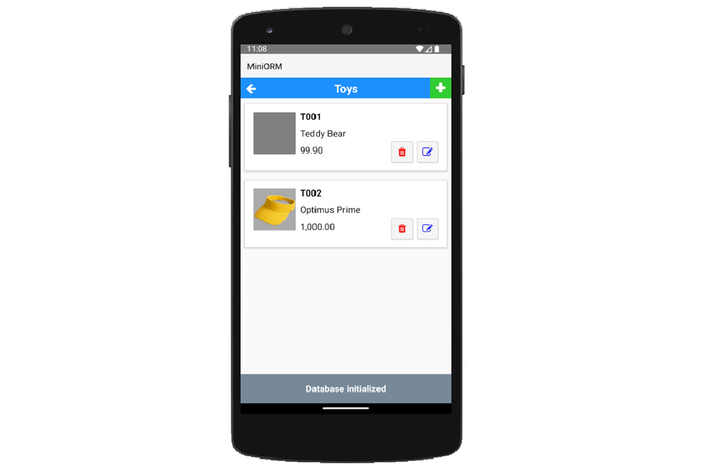

# MiniORM-B4X

**Version 6.00** | [MiniORMUtils Library](https://github.com/pyhoon/MiniORMUtils-B4X)

A cross-platform **B4X** demo / template project showcasing the **MiniORMUtils** library — a lightweight, fluent ORM for B4A (Android), B4i (iOS), and B4J (Desktop/Server).

> This repository contains the template/demo app. The actual ORM library source lives at [MiniORMUtils-B4X](https://github.com/pyhoon/MiniORMUtils-B4X).



---

## Features

- **Cross-platform**: single codebase runs on Android, iOS, and Desktop (Windows, macOS, Linux)
- **3 database backends**: SQLite (all platforms), MySQL & MariaDB (B4J)
- **Fluent API**: chainable property-driven query builder
- **Automatic schema generation**: `CREATE TABLE` / `DROP TABLE` from column definitions
- **Full CRUD**: Insert, Select, Update, Delete, Soft Delete, Batch Delete
- **JOIN support**: INNER, LEFT, RIGHT, FULL OUTER, CROSS JOIN
- **WHERE builder**: parameterized conditions with `?` placeholders
- **Aggregations**: GROUP BY, HAVING, ORDER BY, LIMIT / pagination
- **BLOB support**: store and retrieve images / binary data
- **Timestamps & Audit**: auto-managed `created_date`, `modified_date`, `deleted_date`, and `created_by`, `modified_by`, `deleted_by` columns
- **Transactions**: BeginTransaction / Commit / Rollback
- **Batching**: queue multiple statements and execute as a batch
- **DB schema inspection**: `TableExists`, `ViewExists`, `ListTables`, `ShowCreateTable`
- **SQL logging**: built-in query logging for debugging

---

## Supported Databases

| Database  | B4A  | B4i  | B4J  |
|-----------|:----:|:----:|:----:|
| SQLite    |  ✓   |  ✓   |  ✓   |
| MySQL     |  ✗   |  ✗   |  ✓   |
| MariaDB   |  ✗   |  ✗   |  ✓   |

---

## Requirements

- [B4A](https://www.b4x.com/b4a.html) v11.00+ (Android)
- [B4i](https://www.b4x.com/b4i.html) v7.00+ (iOS)
- [B4J](https://www.b4x.com/b4j.html) v9.00+ (Desktop/Server)
- [MiniORMUtils](https://github.com/pyhoon/MiniORMUtils-B4X/releases) v6.00 library

### JDBC Drivers (B4J only)

- **SQLite**: `sqlite-jdbc-3.7.2`
- **MySQL**: `mysql-connector-j-9.3.0`
- **MariaDB**: `mariadb-java-client-3.5.6`

---

## Library Dependencies

This template uses the following B4X libraries:

| Library | B4A | B4i | B4J | Purpose |
|---------|:---:|:---:|:---:|---------|
| **MiniORMUtils** v6.00 | ✓ | ✓ | ✓ | ORM engine (core dependency) |
| **B4XPages** | ✓ | ✓ | ✓ | Cross-platform page navigation framework |
| **XUI Views** | ✓ | ✓ | ✓ | Cross-platform UI controls (B4XView, B4XImageView, etc.) |
| **B4XPreferencesDialog** | ✓ | ✓ | ✓ | Form/dialog generation from JSON templates |
| **CustomListView** | ✓ | ✓ | ✓ | Virtualized scrollable list control |
| **jServer** (B4J) | ✗ | ✗ | ✓ | JDBC connection pool for MySQL/MariaDB |
| **JavaObject** (B4J) | ✗ | ✗ | ✓ | Java reflection for JDBC driver access |

> **Note**: `jServer` and `JavaObject` are B4J-only and only required when using MySQL or MariaDB backends. All other libraries ship with the B4X IDE.

### Download Links

- **MiniORMUtils**: [https://github.com/pyhoon/MiniORMUtils-B4X/releases](https://github.com/pyhoon/MiniORMUtils-B4X/releases)
- All other libraries ship with the B4X IDE — no separate download needed.

---

## Installation

1. Download the latest `MiniORM (6.00).b4xtemplate` from [Releases](https://github.com/pyhoon/MiniORM-B4X/releases)
2. In the B4X IDE, go to **Tools → Import Template**
3. Select the downloaded `.b4xtemplate` file
4. Open the imported project and configure `ConfigureDatabase` in `B4XMainPage.bas`

---

## Getting Started

### Quick Start with SQLite

```b4x
' 1. Initialize
Dim DB As MiniORM
DB.Initialize
DB.Settings.DBFile = "app.db"
DB.Settings.DBDir = xui.DefaultFolder

' 2. Create table
DB.Table = "categories"
DB.Columns = Array("category_code", "category_name")
DB.Create

' 3. Insert
DB.Columns = Array("category_name")
DB.InsertWithParams = Array("Electronics")

' 4. Query
DB.Open
DB.Table = "categories"
DB.Query
For Each Row As Map In DB.Results
    Log(Row.Get("category_name"))
Next
```

### Quick Start with MySQL (B4J)

```b4x
Dim MS As MiniORMSettings
MS.Initialize
MS.DBType = DB.MYSQL
MS.DBName = "app"
MS.DbHost = "localhost"
MS.User = "root"
MS.Password = "password"
MS.JdbcUrl = "jdbc:mysql://{DbHost}:{DbPort}/{DbName}?characterEncoding=utf8&useSSL=False"
MS.Driver = "com.mysql.cj.jdbc.Driver"
DB.Settings = MS
```

---

## Demo App Walkthrough

The template app is a **Category / Product manager** that demonstrates:

| Feature | Implementation |
|---------|---------------|
| Schema creation | `tbl_categories` and `tbl_products` with foreign key, BLOB, and decimal columns |
| CRUD operations | Add, view, edit, and delete categories and products |
| JOIN queries | Left join between products and categories |
| BLOB storage | Product images stored as byte arrays |
| Duplicate validation | Unique `product_code` and `category_name` checks |
| Batch inserts | Database pre-populated via batched statements |
| Return row | `ReturnRow = True` to get the newly inserted/updated row |
| Error handling | Try/Catch around all database operations |
| Cross-platform UI | B4XPages with CustomListView and PreferencesDialog |

### Screenshots

_Add screenshots of the running app on Android, iOS, and Desktop._

---

## API Overview

The ORM exposes a single `MiniORM` class with a property-driven API. Key areas:

### Configuration

| Method / Property | Description |
|-------------------|-------------|
| `Initialize` | Initialize the ORM instance |
| `Settings` | Apply `MiniORMSettings` (DB type, connection, credentials) |
| `DbType` | Set to `SQLITE`, `MYSQL`, or `MARIADB` |
| `Open` / `Close` | Open / close database connection |
| `CreateSQLite` | Create SQLite database file |
| `CreateDatabaseAsync` | Create MySQL/MariaDB database (B4J, async) |

### Schema (DDL)

| Method | Description |
|--------|-------------|
| `Table = "name"` | Set target table |
| `Columns.Add(...)` | Add column definitions (name, type, size, default, etc.) |
| `Primary = Array(...)` | Set primary key columns |
| `Foreign = "col"` | Set foreign key column |
| `References(table, col)` | Add REFERENCES clause |
| `Unique = Array(...)` | Add UNIQUE constraints |
| `Create` / `Drop` | Create or drop the table |
| `TableExists(name)` | Check if table exists |

### CRUD

| Method | Description |
|--------|-------------|
| `InsertWithParams = Array(...)` | Insert row with parameterized values |
| `SaveWithParams = Array(...)` | Insert or update (based on condition) |
| `Id = n` + `Delete` | Delete by ID |
| `SoftDelete` | Set `deleted_date` instead of deleting |
| `Destroy(Array(...))` | Batch delete multiple IDs |
| `Query` | Execute SELECT and populate `Results` |
| `Find(id)` | Find by primary key |
| `First` / `Last` | Get first/last result row as Map |
| `RowCount` / `Found` | Result count and existence check |

### Query Building

| Property | Description |
|----------|-------------|
| `Columns` | SELECT columns (or INSERT columns) |
| `Join(modifier, target, criteria)` | Add JOIN clause |
| `WhereParam(statement, param)` | Append parameterized condition |
| `Conditions = Array(...)` | Set multiple WHERE conditions |
| `Parameters = Array(...)` | Set parameter values |
| `OrderBy = CreateMap(...)` | ORDER BY clause |
| `GroupBy = Array(...)` | GROUP BY clause |
| `Having = Array(...)` | HAVING clause |
| `Limit = "n"` | LIMIT clause |

### Utility

| Method | Description |
|--------|-------------|
| `Reset` | Clear all conditions, joins, columns, parameters |
| `ShowExtraLogs = True` | Enable SQL query logging |
| `BeginTransaction` / `Commit` / `Rollback` | Transaction control |
| `QueryAddToBatch = True` | Queue statements for batch execution |
| `ExecuteBatchAsync` | Execute all queued batch statements |

For the **complete API reference**, see the [MiniORMUtils-B4X repository](https://github.com/pyhoon/MiniORMUtils-B4X).

---

## Version History

| Version | Notes |
|---------|-------|
| **v6.00** | Current release — matches MiniORMUtils library v6.00 |
| v4.10 | Updated to MiniORMUtils v4.10, added Starter.bas for B4A |
| v4.00 | Major update |
| v2.10–2.11 | README and minor updates |
| v2.00 | Major update |
| v1.05–1.06 | Initial public releases |

---

## License

This template project is available under the **MIT License**.

The underlying [MiniORMUtils](https://github.com/pyhoon/MiniORMUtils-B4X) library is also MIT-licensed.

Copyright (c) 2026 Poon Yip Hoon (Aeric)

---

## Author

**Poon Yip Hoon (Aeric)**

- GitHub: [@pyhoon](https://github.com/pyhoon)
- B4X Community: [aeric](https://www.b4x.com/android/forum/members/aeric.74499/)

---

### Related Repositories

- [MiniORMUtils-B4X](https://github.com/pyhoon/MiniORMUtils-B4X) — the core ORM library
- [B4XPages - Cross platform and simple framework for managing multiple pages](https://github.com/AnywhereSoftware/B4X_Forum_Resources/tree/main/B4X/Tutorials/B4XPages%20-%20Cross%20platform%20and%20simple%20framework%20for%20managing%20multiple%20pages) - by Erel
